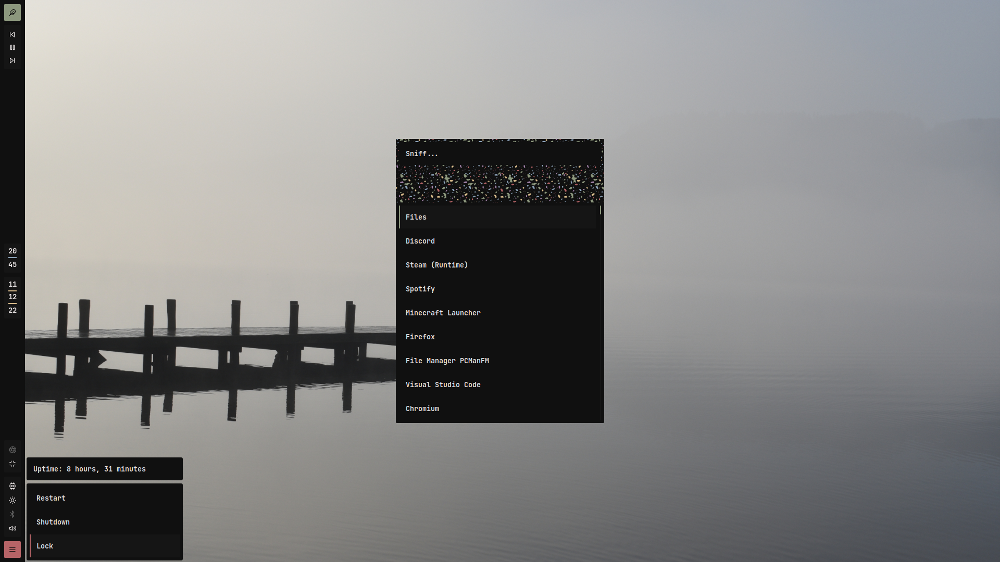

# Config Files

Fluffy's config files for Arch Linux on Qtile!!!!!!!!!!!!!

    
    
I dont update this screenshot reguarly, so sowwy

## Keybinds
| Keys | Action |
| ---- | ------ |
| mod + r | Rofi |
| mod + t | Alacritty |
| mod + b | Firefox |
| mod + f | Mute/Unmute Microphone |
| mod + q | Exit app |
| mod + l | Locks screen |
| mod + m | Toggles fullscreen |
| mod + g | Toggles floating app |
| mod + y | Switches tiling mode |
| mod + [1-9] | Switches workspace |
| mod + Tab | Scrolls through window focus |
| mod + arrow keys | Moves window focus |
| mod + ctrl + arrow keys | Shuffles window order |
| mod + shift + arrow keys | Resizes window |
| mod + shift + tab | Resets window sizing |
| mod + shift + q | Quit Qtile |
| mod + shift + r | Restarts Qtile |
| screenshot | flameshot |

## Credits

[Paradise](https://github.com/Manas140/paradise) colour scheme made by Manas

I took great insperation from Manas' and Saimoomedits' dotfiles
- [Manas](https://github.com/Manas140/dotfiles)
- [Saimoomedits](https://github.com/saimoomedits/dotfiles)

